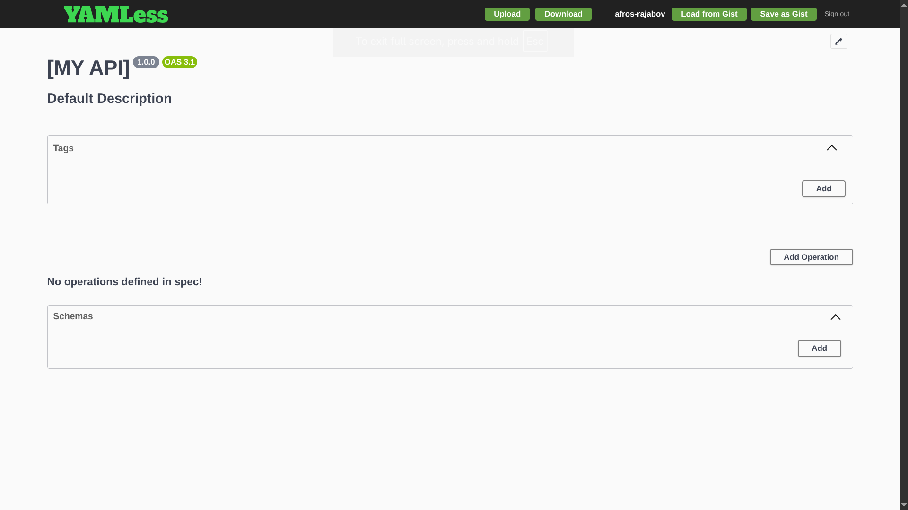
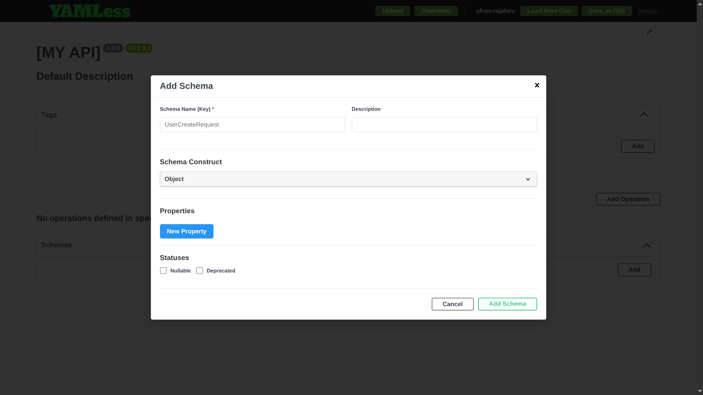
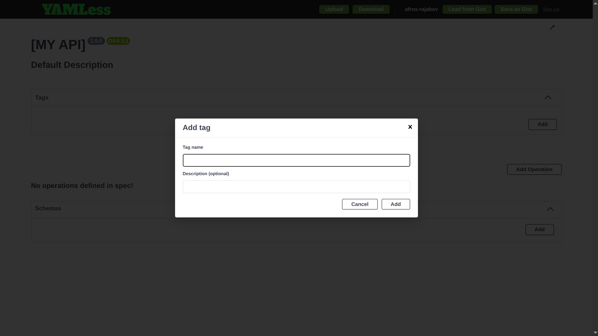
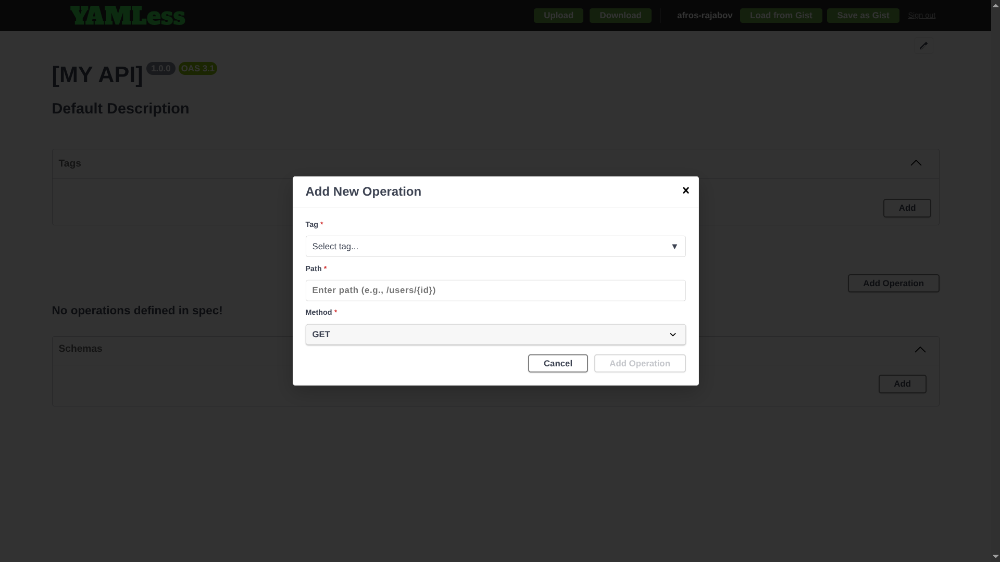
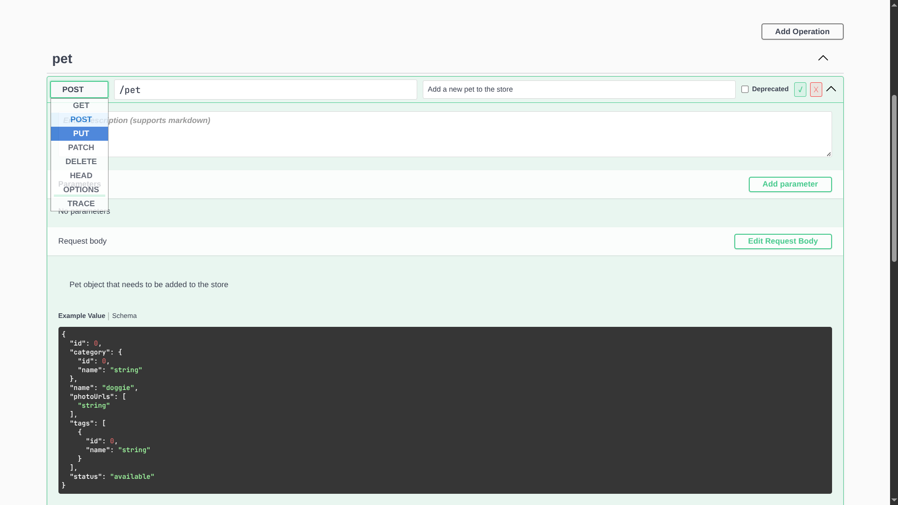
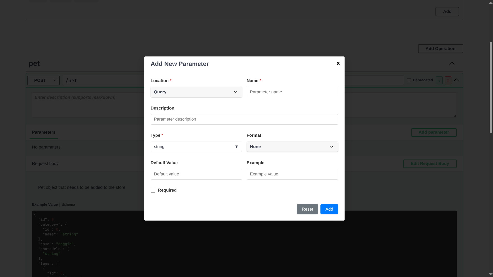
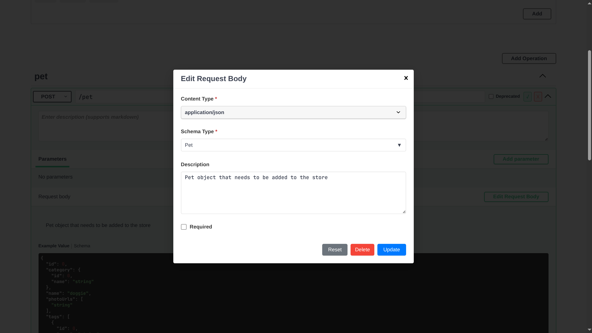
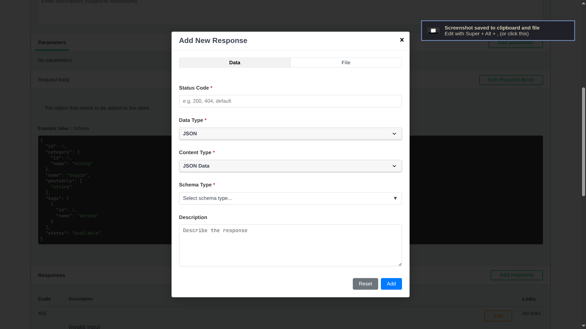
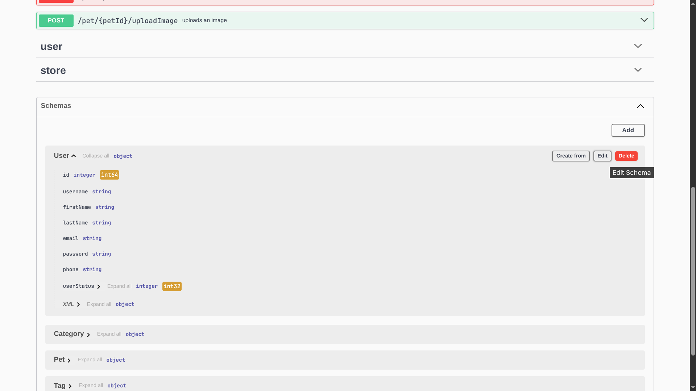
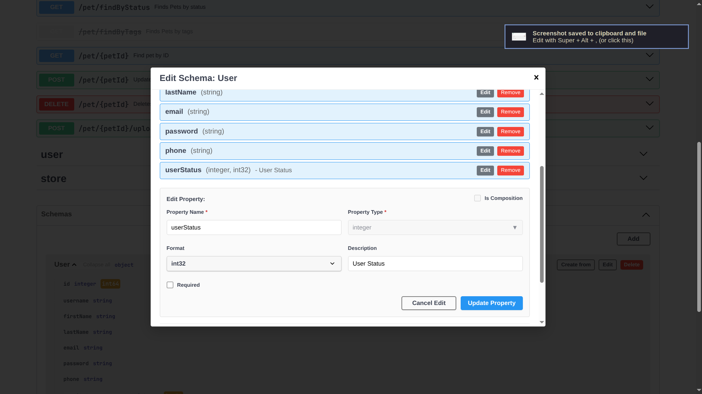

<h1 align="center">
  <a href="https://afros-rajabov.github.io/yamless-editor/">
    
  </a>
</h1>

<p align="center">
  <strong>OpenAPI in the browser: edit the spec, not the YAML.</strong>
</p>

<p align="center">
  <a href="https://afros-rajabov.github.io/yamless-editor/"><strong>Use it online (free, no signup)</strong></a>
  &nbsp;·&nbsp;
  <a href="./LICENSE"></a>
</p>

---

**YAMLess** is a Swagger-based UI for **viewing and editing OpenAPI** visually. Skip raw YAML: change paths, operations, and metadata where you already explore your API.

### Highlights

- **In-browser editing:** iterate on your OpenAPI document without hand-editing YAML files in place
- **Familiar Swagger surface:** same mental model as Swagger UI, tuned for editing workflows
- **Open source:** Apache-2.0 (inherits the Swagger UI ecosystem)

### Screenshots

<table>
  <tr>
    <td></td>
    <td></td>
  </tr>
  <tr>
    <td></td>
    <td></td>
  </tr>
  <tr>
    <td></td>
    <td></td>
  </tr>
  <tr>
    <td></td>
    <td></td>
  </tr>
  <tr>
    <td></td>
    <td></td>
  </tr>
</table>

### Run locally

```bash
npm install
npm run dev
```

Dev server: **<http://localhost:3200>**

### Build

```bash
npm run build
```

Static output lands in `dist/`. Use `npm start` to serve `dist/` and open the app in a browser.

---

<p align="center"><sub>YAML optional. APIs first.</sub></p>
